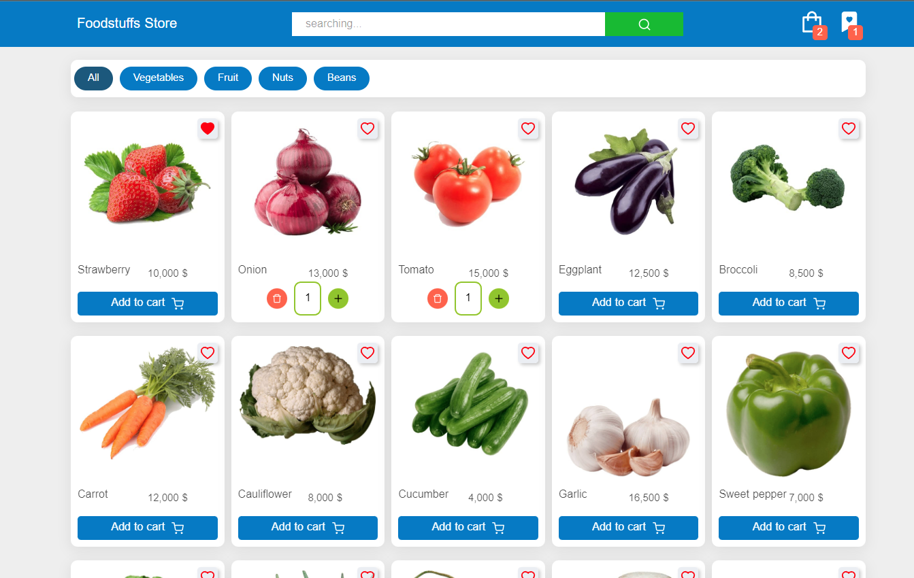
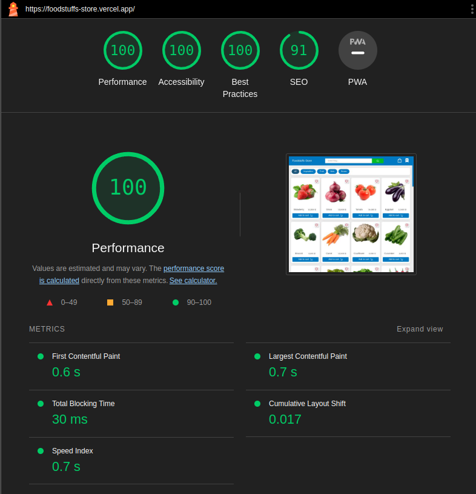

# Foodstuffs Store 🧺

### Package in Project

- React v18.2
- react-router-dom v6.3.0
- React Icon

----

### Feature

- SPA "with react router dom"
- info page for products
- state management with useReducer Hook and Context Api
- RTL & LTR webSite
- 2 Language Support
- 2 Language Search
- Local Storage State management
- Favorite Page
- Add , Delete , Delete All Favorite products
- Filter Based on category
- Filter Based on Products Name
- Full Responsive in All Device
- ‌Basket shopping
- Add, Delete, Clear Basket, Decrease, Increase, Product in Basket
- Show Number of products In Badge
- calculation Total Price
- Shipping cost calculation
- calculation Price After confirmation offer code

----

### [Live Demo]() on Vercel

----

Screenshot

  

----

Lighthouse Speed

  

